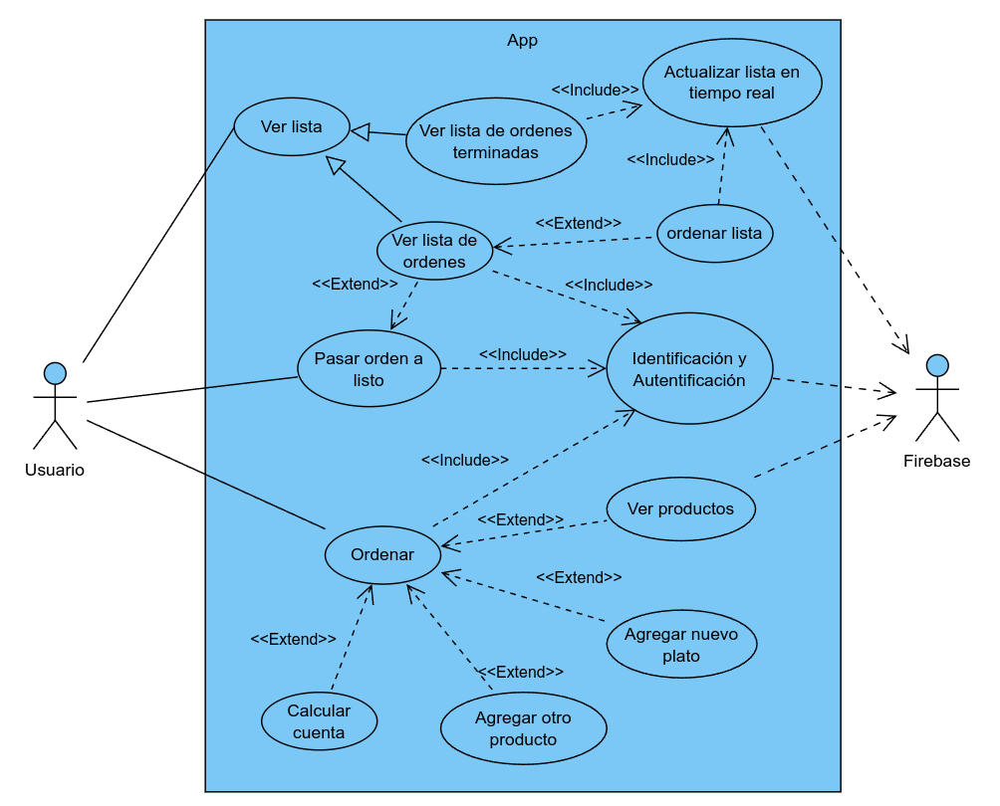

# Tres Reyes Tacos App Móvil
App móvil para gestionar pedidos. Inicio de sesión con Google, ver y administrar listas de pedidos pendientes y completados, marcar pedidos como terminados, tomar nuevos pedidos y recibir actualizaciones. Todo en tiempo real.

Tecnologías utilizadas:
- [**Flutter version 3.19.6**](https://flutter.dev/)
- [**Firebase version 13.7.5**](https://firebase.google.com/?hl=es-419)

Integrantes:
- Carrillo Araujo Ibis
- Martin Ake Edwin Apolonio
- Darwin Miguel Huchim Dzib
- Ricardo Alejandro Ayala Canche

## Introducción

El proyecto de desarrollo de una aplicación móvil para la gestión de pedidos de la taquería Tres Reyes Tacos representa una iniciativa clave para mejorar la eficiencia operativa y la experiencia del cliente. Esta aplicación ofrecerá a los empleados la capacidad de gestionar pedidos de manera más eficiente y precisa, lo que reducirá los errores y los tiempos de espera, al tiempo que mejorará la calidad del servicio.

## Objetivo del proyecto

El objetivo del proyecto es desarrollar una aplicación móvil personalizada para la taquería Tres Reyes Tacos, con el propósito de optimizar sus operaciones internas y mejorar la satisfacción del cliente. Esta aplicación permitirá a los empleados tomar pedidos de manera eficiente reduciendo los errores y los tiempos de espera. Además, facilitará la generación de informes diarios de ventas, lo que mejorará la capacidad de análisis y la toma de decisiones estratégicas por parte de la administración. Con un enfoque centrado en la experiencia del usuario y la eficiencia operativa, el proyecto busca brindar una solución integral que impulse elcrecimiento y la competitividad de la taquería en el mercado actual.

## Diagrama de casos de uso

Este diseño ilustra la interacción entre el actor y los casos de uso, resaltando como el usuario interactua con la aplicación móvil.

    

